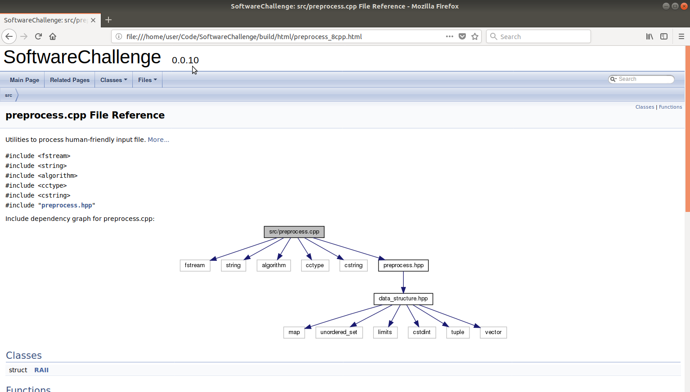

# Documentation

Just using the usual suspect [Doxygen](http://www.stack.nl/~dimitri/doxygen/download.html). 
See [further details](https://p5r.uk/blog/2014/cmake-doxygen.html) on how to configure your environment
but **don't** forget to have [Graphviz](https://graphviz.gitlab.io/_pages/Download/Download_windows.html) installed in order to make **dot** available.

So comment properly your code and invoke the usual suspect **CMake** target. 
Pay attention to the fact that building your code is not needed for generation your documentation.

## Windows

Provided you got your latest Windows10 box (>= 1803) with latest Visual Studio Community Edition (>= 15.7.3) and needed tools, as CMake (>= 3.11.3) or Doxygen (>= 1.8.14),
usual *CMake* commands, taking for granted they are launched from **Development Command Prompt for VS 2017** console:

	mkdir build
	cd build 
	cmake .. -G "Visual Studio 15 2017 Win64" -DEXTRA:STRING=yes
	doxygen doc/Doxyfile

The documentation should be generated inside of **html** folder at that *build* directory:

	start firefox .\html\index.html

Using *firefox* because latest *Microsft Edge* versions seem not to be happy with starting from commandline local content; there must be a way I don't know.

## Linux 

Provided you got your latest needed tools, as CMake or Doxygen/Graphviz, on your distro, usual commands are expected:

	mkdir -p build
	cd build 
	cmake .. -DEXTRA:STRING=yes
	doxygen doc/Doxyfile

In case that a regeneration of that documentation is required, i.e. external task as **webhooks**, invoke its *specific target* and keep an eye on its references:

	cmake --build . --target regenerate_doc

Once you are at that *build* folder, specially if you're debugging documentation, just invoke directly **doxygen**:

The documentation should be generated inside of **html** folder at that *build* directory:

	firefox .\html\index.html

## macOS

Provided you got update your macOS box with latest apple clang c++ compiler (>= 9.1.0) and needed tools, as CMake (>= 3.11.4) or Doxygen (>= 1.8.14), maybe through Homebrew or similar, alomst the very same Linux commands:

	mkdir -p build
	cd build 
	cmake .. -DEXTRA=yes
	doxygen doc/Doxyfile

In case that a regeneration of that documentation is required invoke its *specific target* and keep an eye on its references:

	cmake --build . --target regenerate_doc

The documentation should be generated inside of **html** folder at that *build* directory:

	opan -a Safari .\html\index.html

# Documentation version

As stated at [BUILDING](BUILDING.md), that syncronized version number is maintained at the main [CMakeLisis.txt file](CMakeLists.txt) and purging CMake caches is needed to properly update it.

# Diagrams

Among zillions of available possibilities, [PlantUML](plantuml.com) lets you generate **dot** based diagrams from text files.
Besides, it could be integrated with *Doxygen* and those diagrams keep their meta-information embedded. 
So if needed in the future, from the very same image, you can obtain and update manually its contents.

In case of this *toy project*, no extra *CMake* targets will be added to generate those images or
to double check its embedded meta-information to avoid regenerate them if not needed (that way
you don't end uploading again and again your images to your repository).

Provided your diagram is saved as *diagram.uml* and **plantuml.jar** is placed at *C:/plantuml/plantuml.jar* on Windows, generate and check with:

	cd .\images
	java -jar C:\plantuml\plantuml.jar -progress .\diagram.uml
	start firefox .\diagram.png

On Linux, something similar provided that *jar* file is placed at */opt/plantuml/plantuml.jar* instead:

	cd ./images	
	java -jar /opt/plantuml/plantuml.jar -progress ./diagram.uml
	firefox ./diagram.png

On macOS, almost the very same than Linux:

	cd ./images	
	java -jar /opt/plantuml/plantuml.jar -progress ./diagram.uml
	open -a Safari ./diagram.png

# Presentation

The HTML Presentation Framework [REVEAL.JS](https://revealjs.com) was chosen due to its easy update and deployment on a typical server as **nginx**.

That deployment just followed standard [reveal.js installation instructions](https://github.com/hakimel/reveal.js#installation) with the expected extra steps to publish that presentation at the [public server](https://xue2sheng.com/presentations/index.html):

1) Download or clone [reveal.js](https://github.com/hakimel/reveal.js.git) project in your working directory, i.e. **/home/user/Code**, on your server, i.e. one Debian box.

2) Get ready your server configuration, i.e. **/etc/nginx/sites-available/default**, provided that *default* configuration is enabled at **/etc/nginx/sites-enable**. Don't forget to update those changes, i.e. *sudo nginx -t* and *sudo nginx -s reload*:

         location /reveal.js/ {
            alias /var/www/reveal.js/;
         }
         location /doxygen/ {
            alias /var/www/doxygen/;
            autoindex on;
         }
         location /presentations/ {
            alias /var/www/presentation/;
            autoindex on;
         }

3) Create previous configured folders:

		sudo ln -s /home/user/Code/reveal.js /var/www
		sudo ln -s /home/user/Code/SoftwareChallenge/build/html /var/www/doxygen
		sudo mkdir -p /var/www/presentation

4) A *louncher index.html* if required in order to internally point to our project **Markdown** information as hinted at [reveal external markdown help](https://github.com/hakimel/reveal.js#external-markdown). The easiest approach is to use [the one provided by this project](doc/index.html) by just soft-linking it:

		sudo ln -s /home/user/Code/SoftwareChallange/doc/index.html /var/www/presentation

5) Link your project information to that HTML server. That way your presentation file can be treated and updated as another typical code file:

		sudo ln -s /home/user/Code/SoftwareChallange/PRESENTATION.md /var/www/presentation
		sudo ln -s /home/user/Code/SoftwareChallange/images /var/www/presentation
	

	

 
