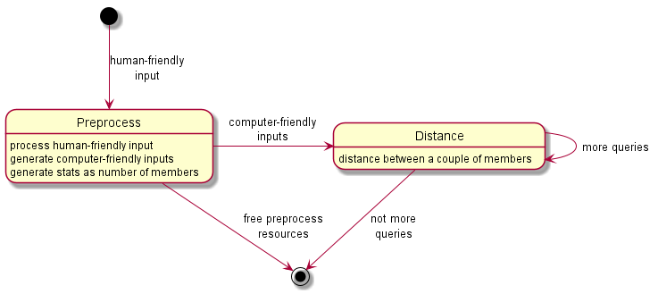
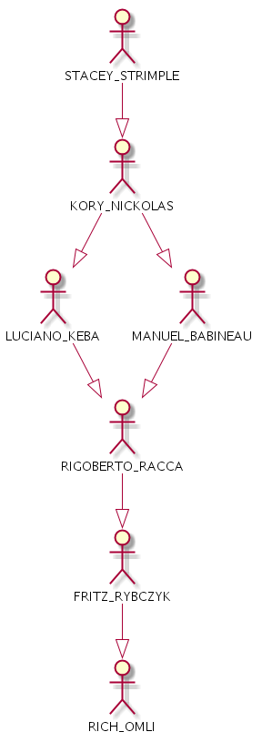

# Software Challenge

Given a **SocialNetwork.txt** input file with the following structure:

    MYLES_JEFFCOAT,LANNY_TIBURCIO
    MYLES_JEFFCOAT,MARTIN_OMERSA
    MYLES_JEFFCOAT,SAM_SWAIT
    MYLES_JEFFCOAT,TERENCE_SEISLER

The file represents an imaginary social network of people. Each line in the file provides the
names of two people who are friends. Write a program that

1. determines the total number of people in the social network

2. determines the distance between A and B where the distance between two members of
the network can be defined as the minimum number of ties required to connect two
people in the social network

For this challenge, the values of A and B are as follows: A = STACEY_STRIMPLE, B =
RICH_OMLI

## Simplifications

Some facts will be supposed in order to simplify the solution:

1. The input file is not too huge and it can be processed as a whole in the available memory. 
For example, 15 Mb of pre-processed text input against 32 Gb of available memory.

2. Names are encoded in typical ASCII format and they are not too lengthy. 
Please, no more *emojis* this time ;)

3. The input doesn't change too often so it makes sense to invest time and resources on pre-processing once 
to get a more *computer-friendly* equivalent. As well this pre-process lets us collect stats on input data, 
always useful to tune code later on.

## Approach

Typical divide & conquer approach:

1. One binary for the **pre-process** of the original input file and 
provides *at least* the total number of people in the social network 
and more *computer-friendly* inputs for following steps.

2. One binary that reads that previously processed input and determines 
the **distance** between A and B as the minimum number of ties required 
to connect A and B. See *pending tasks* at [BUILDING](BUILDING.md) and
[TESTING](TESTING.md) pages to check it out how far the code really accomplish of this approach.

That way it's easier to test and to hunt bugs down, 
taking incremental steps as the ones in typical Agile sprints. 
Besides, if some **microserver** solution might be tried, getting that task division
will help out a lot.

## Data structures

Resisted the temptation of using already tested libraries, as *Boost*, there are three main structures:

1) **NameIndex**: a map between *names as strings* and *integers as indexes*.

2) **FiendGraph**: kind of array (vector) to keep the *adjuncency* list of friends to build up that graph.

3) **Collection**: let us generate previous ones from out text file. As well it was attempted to work with binary
data to speed up loading times and spare harddisk room but that part is pending.

## Algorithm

To be honest, nothing too much involved: typical Breadth First Search with a adjuncecy list for friends.

Some special tricks were implemented to improved that basic BFS:

1) When the list of friends is compacted from the text file into the memory array structure **FriendGraph**,
the **most popular** friends were **sorted** in the very first places. That way they will be the first ones in being searched through.

2) Taking advantage from the fact that it's a bidirectional graph, **two concurrent** searches from A and B,
trying to **meet in the middle**. So more effort was placed in locate those **common links** than marking A and B as directly reached.

3) Previous step implied the use of **threads** so it was attmpted to use **atomics** instead of **mutex** as much as possible.
Besides, two **functor c++ objects** were coded in order to be launched by threads with its informatio as properties instead of function arguments.
That way it was easier to debug.

4) Extra **summary** information as **hints** was logged in order to allow to *reverse engineer* how that algorithm works and
to be able to walk back intermediary **common** nodes to manually check them out against the text file:

## Results

Execute the program without arguments and obtain the information required:

    Searching for default possible friends A = STACEY_STRIMPLE, B = RICH_OMLI
    Number of members in that social network: 82168
    STACEY_STRIMPLE[56069]<-->RICH_OMLI[79562]   5 should suffice   commonB=LUCIANO_KEBA[62]<5>
    
The extra hint about that *common* node can be used in another executation again:

    src/SoftwareChallenge -l LUCIANO_KEBA,STACEY_STRIMPLE,LUCIANO_KEBA,RICH_OMLI

That generates the following output:

    Search 0: LUCIANO_KEBA and STACEY_STRIMPLE
    Search 1: LUCIANO_KEBA and RICH_OMLI
    Number of members in that social network: 82168
    LUCIANO_KEBA[62]<-->STACEY_STRIMPLE[56069]   2 should suffice   commonA=KORY_NICKOLAS[6074]<2> commonB=KORY_NICKOLAS[6074]<2>
    LUCIANO_KEBA[62]<-->RICH_OMLI[79562]   3 should suffice   commonB=RIGOBERTO_RACCA[6096]<3> 

Knowing that it's only **five** ties to walk through, the previous process can be repeated untill the following graph is obtained:

## Working environment

Windows 10 with Visual Studio Community Edition was the default one but as well it was
checked out on Linux/macOS boxes when possible. See [Working environment hints](ENVIRONMENT.md)
