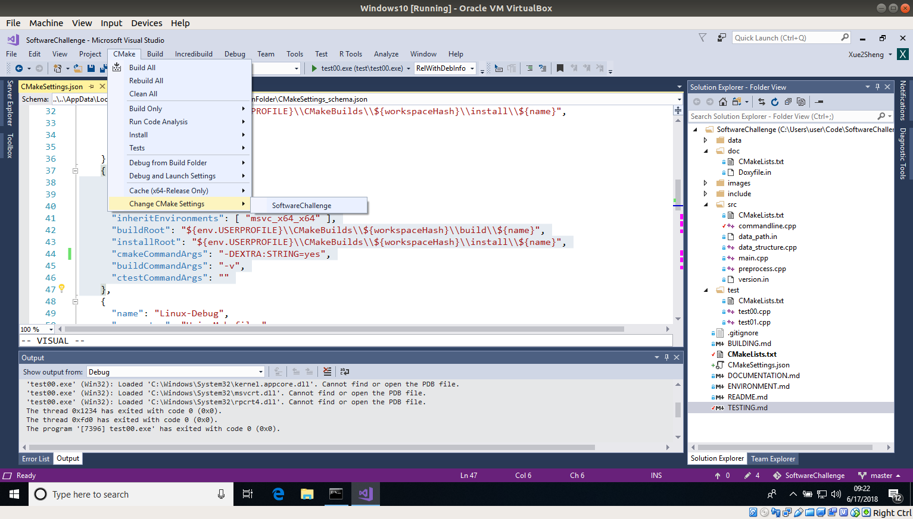
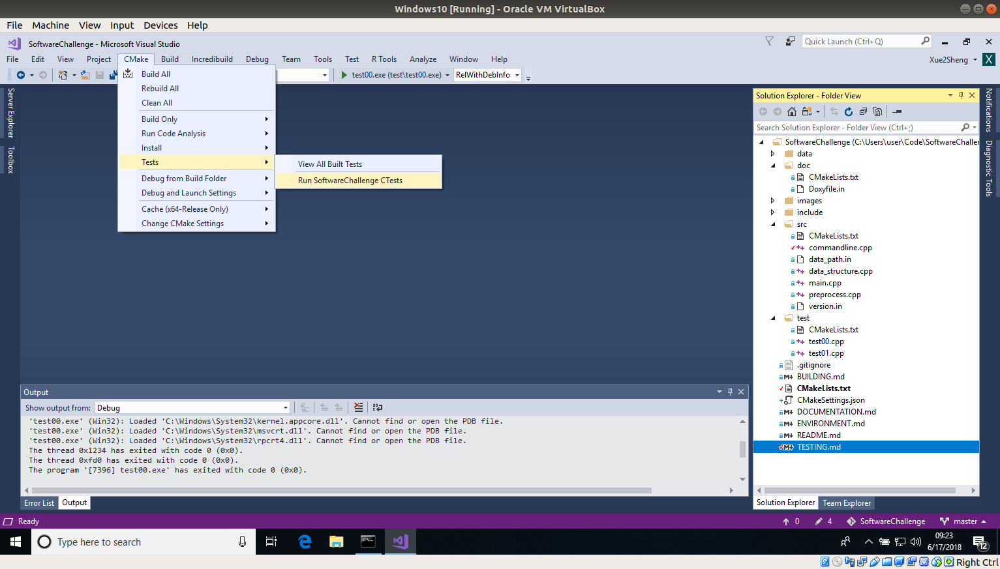
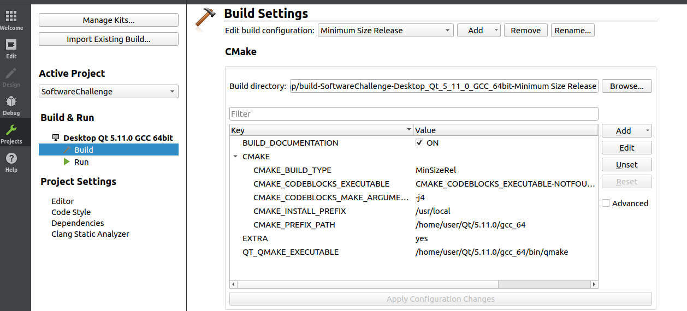
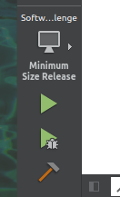

# Testing

For unit tests, external [Catch2](https://github.com/catchorg/Catch2) library will be used.
Just drop its single include header file **catch.hpp** onto *include* project folder.

Due to the fact, **CMake** is used in this project, just typical **ctest** command will do the trick: 

## Windows

Provided you got your latest Windows10 box (>= 1803) with latest Visual Studio Community Edition (>= 15.7.3) and needed tools, as CMake (>= 3.11.3),
usual *CMake* commands, taking for granted they are launched from **Development Command Prompt for VS 2017** console:

	mkdir build
	cd build
	cmake .. -G "Visual Studio 15 2017 Win64" -DEXTRA:STRING=yes
	cmake --build . --config Release
	ctest -C Release

If you want to launch it directly in order to obtain more details, provided you're in that *build* folder:

	.\test\Release\test00.exe --use-colour yes --success
	.\test\Release\test01.exe --use-colour yes --success

## Linux 

Provided you got your distro up to date for latest c++ compilers and needed tools, as CMake, similar commands to Windows are expected:

	mkdir -p build
	cd build
	cmake .. -DEXTRA:STRING=yes
	cmake --build . 
	ctest 

If you want to launch it directly in order to obtain more details, provided you're in that *build* folder:

	./test/test00 --use-colour yes --success
	./test/test01 --use-colour yes --success

## macOS

Provided you got update your macOS box with latest apple clang c++ compiler (>= 9.1.0) and needed tools, as CMake (>= 3.11.4), maybe through Homebrew or similar, the very same Linux commands:

	mkdir -p build
	cd build
	cmake .. -DEXTRA:STRING=yes
	cmake --build .
	ctest

If you want to launch it directly in order to obtain more details, provided you're in that *build* folder:

	./test/test00 --use-colour yes --success
	./test/test01 --use-colour yes --success

# Testing from IDE's

As you have already realized, *CMake* requires an **EXTRA** flag in order to get ready for tests and documentation.
So you should configure your favorite cmake-friendly IDE to do so:

## Visual Studio Community Edition 2017

Add that *string* **EXTRA** flag to your default CMake Settings Command Arguments at *CMakeSettings.json* for your chosen release, i.e. **x64-Release**, by opening it from menu **CMake -> Change CMake Settings**:

    {
      "name": "x64-Release",
      "generator": "Ninja",
      "configurationType": "RelWithDebInfo",
      "inheritEnvironments": [ "msvc_x64_x64" ],
      "buildRoot": "${env.USERPROFILE}\\CMakeBuilds\\${workspaceHash}\\build\\${name}",
      "installRoot": "${env.USERPROFILE}\\CMakeBuilds\\${workspaceHash}\\install\\${name}",
      "cmakeCommandArgs": "-DEXTRA:STRING=yes",
      "buildCommandArgs": "-v",
      "ctestCommandArgs": ""
    }

Once everything is properly rebuilt, you can launch your tests from menu **CMake -> Tests**.

## QtCreator

Provided you're starting from scratch, meaning not reusing one already generated commandline build folder, QtCreator should be instructed to add that **EXTRA** flag when **CMake** is launched.
In order to do so, add that *string* Extra flag to your chosen release, i.e. **Minimun Size Release**, from menu **Projects -> Run & Build  -> Build -> Add**. 
Don't forget to click button **Apply Configuration Changes**.

Once everything is properly rebuilt, you can launch your test from usual menu **Run** (play symbol) provided its selected for that **Minimum Size Release**.

# Pending tasks

Testing very low level pointer operations to load binary files directly into memory or debugging all the corner cases in multthreaded applications are prone to errors.
So take with a pinch of salt that part of the code because it's incomplete.

We'd better to execute that executable **in production** only with text file inputs (files ending in *.txt*) and focus preferably only in the provided **SocialNetwork.txt**.
That file has been checked it out more seriously with unit and manual tests.
Take advantage from the fact that **a list of pair elements** can be provided in order not to have to load the graph in memory every single time.